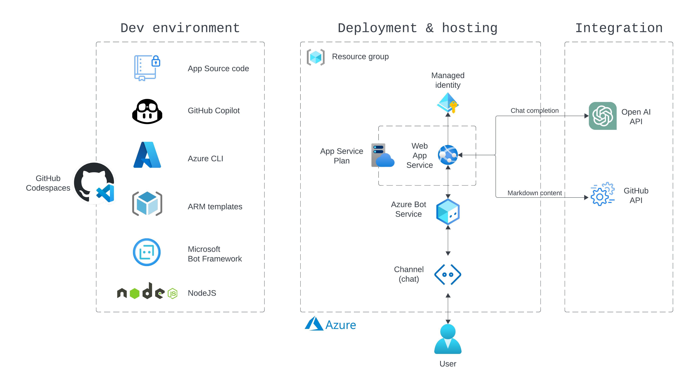

<h1 align="center">UniverseCopilot</h1>
<p align="center">
  
</p>

## Intro

This repository template contains the source code for the chatbot application, in addition to a step-by-step guide on how to deploy it to Azure.

Please see the main workshop repository [`githubuniverseworkshops/workshop-build-deploy-your-own-copilot`](https://github.com/githubuniverseworkshops/workshop-build-deploy-your-own-copilot) for additional resources and learning material.

> [!NOTE]
> This repo is intended to give an introduction to various **GitHub Copilot** features, such as **Copilot Chat** and **Copilot CLI**. Hence the step-by-step guides below contain the general description of what needs to be done, and Copilot Chat and/or Copilot CLI can support you in generating the necessary commands.
>
> Each step (where applicable) also contains a `Cheatsheet` which can be used to validate the Copilot suggestion(s) against the correct command.
>
> :bulb: Play around with different prompts and see how it affects the accuracy of the GitHub Copilot suggestions. E.g. Copilot CLI offers a :memo: `Revise query` option that can be used to refine the suggestion without writing the whole prompt anew.

## Features of the chatbot

- Give a greeting when entering the chat
- List `markdown` files in any public GitHub.com repository as selectable options
- Create an AI-generated summary of the selected `markdown` file, e.g. a `README.md`

## Overview

- This chatbot source code is based on the [Microsoft Bot Framework SDK](https://learn.microsoft.com/en-us/azure/bot-service/index-bf-sdk?view=azure-bot-service-4.0)
- The [OpenAI API](https://platform.openai.com/docs/api-reference) is used for generating text summaries
- The bot is intended for deployment to Azure



## Preparation

The VSCode Codespaces image ([`.devcontainer/devcontainer.json`](.devcontainer/devcontainer.json)) has been configured with the following tooling;
  - GitHub Copilot (VSCode extension)
  - Azure CLI `v1.2.1`

> [!WARNING]
> Some of the resources used in this workshop might incur additional charges. Please see the main workshop repository [`githubuniverseworkshops/workshop-build-deploy-your-own-copilot`](https://github.com/githubuniverseworkshops/workshop-build-deploy-your-own-copilot) for links to the relevant billing information.

#### 1. Create a new repository from this template 

:hourglass_flowing_sand: **~2min** 

- Click `Use this template` :point_right: `Create a new repository`
- Set owner to your personal GitHub user
- Give it a name
- Set visibility to `Private`
- Click `Create repository`

#### 2. Create a Codespace using the provided template

:hourglass_flowing_sand: **~3min** 

- In the newly created repo, click `Code` :point_right: `Codespaces` :point_right: `[ellipsis menu]` :point_right: `New with options` :point_right: _Ensure that `Dev container configuration` is set to `Default project configuration`_ :point_right: `Create codespace`
- ❗If you're having problems launching the Codespace then you can also clone the repo and continue from here in your IDE
  - There is no need to push changes back to the repo during the workshop

```sh
git clone https://github.com/<YOUR_NAME_SPACE>/<YOUR_REPO_NAME>.git
cd <YOUR_REPO_NAME>
```

#### 3. Configure additional tooling 

:hourglass_flowing_sand: **~3min** 

- Install GitHub Copilot CLI

```sh
npm i -g @githubnext/github-copilot-cli
```

```sh
eval "$(github-copilot-cli alias -- "$0")"
```

- 💡 The command below is necessary if you have not already authorized GitHub Copilot CLI

```sh
github-copilot-cli auth
```

- Verify that Copilot CLI is functioning by asking it a question

```sh
?? Which version of node is installed
```

- Expected output

```sh
 ──────────────────── Command ────────────────────

node --version

 ────────────────── Explanation ──────────────────

○ node is the Node.js runtime.
  ◆ --version specifies that we want to print the version of the runtime.

❯ ✅ Run this command
  📝 Revise query
  ❌ Cancel

  This will execute the suggested command in your shell.
  Are you sure? (y/N)

🕛  Hold on, executing commmand...
v20.8.0
```

#### 4. Authenticate with Azure

:hourglass_flowing_sand: **~2min** 

- The Azure CLI is pre-installed on the Codespace

```sh
az login --use-device-code
```

- Run the command below to show the list of subscriptions tied to the logged in account

```sh
az account list
```

- Set the desired subscription

```sh
az account set --subscription "<subscription_id_OR_name>"
```

#### 5. (Optional) Create OpenAI API key

:hourglass_flowing_sand: **~5min**

- [Sign in](https://platform.openai.com/login) to your Open AI account
- If you don't have an account, create one [here](https://platform.openai.com/signup)
- [Create an API key](https://platform.openai.com/account/api-keys)
  - :bulb: Make sure that you have available an [Credit balance](https://platform.openai.com/account/billing/overview) for API consumption

## Development

> [!IMPORTANT]
> The steps below will require parameter values to be set. Where possible, the following default values have been used in the `Cheatsheet` commands and in configuration files:
> - `Universe2023CopilotRG` (Azure resource group name)
> - `westus` (location)
> - `Universe2023CopilotId` (Azure Identity resource name)
> - `Universe2023CopilotASP` (Azure App Service Plan name)
>
> If you wish to use different values then keep track of them in order to ensure they are consistently used where needed.
> 
> Some values are part of a global namespace and can therefore not be defaulted, for these values only placeholders are provided in the `Cheatsheet` and configuration files:
> - `<appServiceName>` (Azure App Service name)
> - `<botName>` (Azure Bot resource name/handle)

#### 1. See how much you can learn about the source code and framework(s) with the help of Copilot

:hourglass_flowing_sand: **~5min** 

#### 2. Create an Azure resource group in the West US region

:hourglass_flowing_sand: **~1min** 

<details>
<summary>Cheatsheet</summary>

##### Command

```sh
az group create --name "Universe2023CopilotRG" --location "westus"
```

##### Expected output

```sh
{
  "id": "/subscriptions/xxxxxxx-xxxx-xxxx-xxxx-xxxxxxxxxx/resourceGroups/Universe2023CopilotRG",
  "location": "westus",
  "managedBy": null,
  "name": "Universe2023CopilotRG",
  "properties": {
    "provisioningState": "Succeeded"
  },
  "tags": null,
  "type": "Microsoft.Resources/resourceGroups"
}
```

</details>

#### 3. Create an Azure Identity Resource

:hourglass_flowing_sand: **~1min** 

> [!IMPORTANT]
> The following output data from this command will be needed later:
> - `clientId`
> - `tenantId`

<details>
<summary>Cheatsheet</summary>

##### Command

```sh
az identity create --resource-group "Universe2023CopilotRG" --name "Universe2023CopilotId"
```

##### Expected output

```json
{
  "clientId": "xxxxxxx-xxxx-xxxx-xxxx-xxxxxxxxxx",
  "id": "/subscriptions/xxxxxxx-xxxx-xxxx-xxxx-xxxxxxxxxx/resourcegroups/Universe2023CopilotRG/providers/Microsoft.ManagedIdentity/userAssignedIdentities/Universe2023CopilotId",
  "location": "westus",
  "name": "Universe2023CopilotId",
  "principalId": "xxxxxxx-xxxx-xxxx-xxxx-xxxxxxxxxx",
  "resourceGroup": "Universe2023CopilotRG",
  "systemData": null,
  "tags": {},
  "tenantId": "xxxxxxx-xxxx-xxxx-xxxx-xxxxxxxxxx",
  "type": "Microsoft.ManagedIdentity/userAssignedIdentities"
}
```

</details>

#### 4. Create an Azure App Service resource in the resource group. The ARM template is located in "./templates/template-appService.json" and the input parameters are in "./templates/parameters-template-appService.json".

:hourglass_flowing_sand: **~5min** 

> [!IMPORTANT]
> Update the following `parameters` inside `./templates/parameters-template-appService.json`:
> - `appServiceName.value` - a **globally** unique name, e.g. `<yourGitHubHandle>Universe2023CopilotAS`
> - `appId.value` - the `clientId` of the identity resource created earlier
> - `UMSIName.value` - the `name` of the identity resource created earlier
> - `UMSIResourceGroupName.value` -  the `resourceGroup` of the identity resource created earlier
> - `tenantId.value` - the `tenantId` of the identity resource created earlier

<details>
<summary>Cheatsheet</summary>

##### Command

```sh
az deployment group create --resource-group "Universe2023CopilotRG" --template-file ./templates/template-appService.json --parameters ./templates/parameters-template-appService.json
```

##### Expected output

```json
{
  "id": "/subscriptions/xxxxxxx-xxxx-xxxx-xxxx-xxxxxxxxxx/resourceGroups/Universe2023CopilotRG/providers/Microsoft.Resources/deployments/template-appService",
  "location": null,
  "name": "template-appService",
  "properties": {
    "correlationId": "xxxxxxx-xxxx-xxxx-xxxx-xxxxxxxxxx",
    "debugSetting": null,
    "dependencies": [
      {
        "dependsOn": [
          {
            "id": "/subscriptions/xxxxxxx-xxxx-xxxx-xxxx-xxxxxxxxxx/resourceGroups/Universe2023CopilotRG/providers/Microsoft.Web/serverfarms/Universe2023CopilotASP",
            "resourceGroup": "Universe2023CopilotRG",
            "resourceName": "Universe2023CopilotASP",
            "resourceType": "Microsoft.Web/serverfarms"
          }
        ],
        "id": "/subscriptions/xxxxxxx-xxxx-xxxx-xxxx-xxxxxxxxxx/resourceGroups/Universe2023CopilotRG/providers/Microsoft.Web/sites/StebjeUniverse2023CopilotAS",
        "resourceGroup": "Universe2023CopilotRG",
        "resourceName": "StebjeUniverse2023CopilotAS",
        "resourceType": "Microsoft.Web/sites"
      }
    ],
    "duration": "PT36.4806494S",
    "error": null,
    "mode": "Incremental",
    "onErrorDeployment": null,
    "outputResources": [
      {
        "id": "/subscriptions/xxxxxxx-xxxx-xxxx-xxxx-xxxxxxxxxx/resourceGroups/Universe2023CopilotRG/providers/Microsoft.Web/serverfarms/Universe2023CopilotASP",
        "resourceGroup": "Universe2023CopilotRG"
      },
      {
        "id": "/subscriptions/xxxxxxx-xxxx-xxxx-xxxx-xxxxxxxxxx/resourceGroups/Universe2023CopilotRG/providers/Microsoft.Web/sites/StebjeUniverse2023CopilotAS",
        "resourceGroup": "Universe2023CopilotRG"
      }
    ],
    "outputs": null,
    "parameters": {
      "appId": {
        "type": "String",
        "value": "xxxxxxx-xxxx-xxxx-xxxx-xxxxxxxxxx"
      },
      "appSecret": {
        "type": "String",
        "value": ""
      },
      "appServiceName": {
        "type": "String",
        "value": "StebjeUniverse2023CopilotAS"
      },
      "appType": {
        "type": "String",
        "value": "UserAssignedMSI"
      },
      "existingAppServicePlanLocation": {
        "type": "String",
        "value": ""
      },
      "existingAppServicePlanName": {
        "type": "String",
        "value": ""
      },
      "newAppServicePlanLocation": {
        "type": "String",
        "value": "westus"
      },
      "newAppServicePlanName": {
        "type": "String",
        "value": "Universe2023CopilotASP"
      },
      "newAppServicePlanSku": {
        "type": "Object",
        "value": {
          "capacity": 1,
          "family": "S",
          "name": "S1",
          "size": "S1",
          "tier": "Standard"
        }
      },
      "tenantId": {
        "type": "String",
        "value": "xxxxxxx-xxxx-xxxx-xxxx-xxxxxxxxxx"
      },
      "umsiName": {
        "type": "String",
        "value": "Universe2023CopilotId"
      },
      "umsiResourceGroupName": {
        "type": "String",
        "value": "Universe2023CopilotRG"
      }
    },
    "parametersLink": null,
    "providers": [
      {
        "id": null,
        "namespace": "Microsoft.Web",
        "providerAuthorizationConsentState": null,
        "registrationPolicy": null,
        "registrationState": null,
        "resourceTypes": [
          {
            "aliases": null,
            "apiProfiles": null,
            "apiVersions": null,
            "capabilities": null,
            "defaultApiVersion": null,
            "locationMappings": null,
            "locations": [
              "westus"
            ],
            "properties": null,
            "resourceType": "serverfarms",
            "zoneMappings": null
          },
          {
            "aliases": null,
            "apiProfiles": null,
            "apiVersions": null,
            "capabilities": null,
            "defaultApiVersion": null,
            "locationMappings": null,
            "locations": [
              "westus"
            ],
            "properties": null,
            "resourceType": "sites",
            "zoneMappings": null
          }
        ]
      }
    ],
    "provisioningState": "Succeeded",
    "templateHash": "xxxx",
    "templateLink": null,
    "timestamp": "2023-10-19T17:55:24.012856+00:00",
    "validatedResources": null
  },
  "resourceGroup": "Universe2023CopilotRG",
  "tags": null,
  "type": "Microsoft.Resources/deployments"
}
```

</details>

#### 5. Create an Azure Bot resource in the resource group. The ARM template is located in "./templates/template-botResource.json" and the input parameters are in "./templates/parameters-template-botResource.json".

:hourglass_flowing_sand: **~5min** 

> [!IMPORTANT]
> Update the following `parameters` inside `./templates/parameters-template-botResource.json`:
> - `azureBotId.value` - a **globally** unique name, e.g. `<yourGitHubHandle>Universe2023CopilotBot`
> - `botEndpoint.value` - the messaging endpoint for your bot; `https://<appServiceName>.azurewebsites.net/api/messages`
> - `appId.value` - the `clientId` of the identity resource created earlier
> - `UMSIName.value` - the `name` of the identity resource created earlier
> - `UMSIResourceGroupName.value` -  the `resourceGroup` of the identity resource created earlier
> - `tenantId.value` - the `tenantId` of the identity resource created earlier

<details>
<summary>Cheatsheet</summary>

##### Command

```sh
az deployment group create --resource-group "Universe2023CopilotRG" --template-file ./templates/template-botResource.json --parameters ./templates/parameters-template-botResource.json
```

##### Expected output

```json
{
  "id": "/subscriptions/xxxxxxx-xxxx-xxxx-xxxx-xxxxxxxxxx/resourceGroups/Universe2023CopilotRG/providers/Microsoft.Resources/deployments/template-botResource",
  "location": null,
  "name": "template-botResource",
  "properties": {
    "correlationId": "xxxxxxx-xxxx-xxxx-xxxx-xxxxxxxxxx",
    "debugSetting": null,
    "dependencies": [],
    "duration": "PT7.9925706S",
    "error": null,
    "mode": "Incremental",
    "onErrorDeployment": null,
    "outputResources": [
      {
        "id": "/subscriptions/xxxxxxx-xxxx-xxxx-xxxx-xxxxxxxxxx/resourceGroups/Universe2023CopilotRG/providers/Microsoft.BotService/botServices/StebjeUniverse2023CopilotBot",
        "resourceGroup": "Universe2023CopilotRG"
      }
    ],
    "outputs": null,
    "parameters": {
      "appId": {
        "type": "String",
        "value": "xxxxxxx-xxxx-xxxx-xxxx-xxxxxxxxxx"
      },
      "appType": {
        "type": "String",
        "value": "UserAssignedMSI"
      },
      "azureBotId": {
        "type": "String",
        "value": "StebjeUniverse2023CopilotBot"
      },
      "azureBotRegion": {
        "type": "String",
        "value": "global"
      },
      "azureBotSku": {
        "type": "String",
        "value": "F0"
      },
      "botEndpoint": {
        "type": "String",
        "value": "https://StebjeUniverse2023CopilotAS.azurewebsites.net/api/messages"
      },
      "tenantId": {
        "type": "String",
        "value": "xxxxxxx-xxxx-xxxx-xxxx-xxxxxxxxxx"
      },
      "umsiName": {
        "type": "String",
        "value": "Universe2023CopilotId"
      },
      "umsiResourceGroupName": {
        "type": "String",
        "value": "Universe2023CopilotRG"
      }
    },
    "parametersLink": null,
    "providers": [
      {
        "id": null,
        "namespace": "Microsoft.BotService",
        "providerAuthorizationConsentState": null,
        "registrationPolicy": null,
        "registrationState": null,
        "resourceTypes": [
          {
            "aliases": null,
            "apiProfiles": null,
            "apiVersions": null,
            "capabilities": null,
            "defaultApiVersion": null,
            "locationMappings": null,
            "locations": [
              "global"
            ],
            "properties": null,
            "resourceType": "botServices",
            "zoneMappings": null
          }
        ]
      }
    ],
    "provisioningState": "Succeeded",
    "templateHash": "xxxxxxx",
    "templateLink": null,
    "timestamp": "2023-10-19T18:07:03.391786+00:00",
    "validatedResources": null
  },
  "resourceGroup": "Universe2023CopilotRG",
  "tags": null,
  "type": "Microsoft.Resources/deployments"
}
```

</details>

#### 6. Update the configuration variables (`.env`) for the Azure bot

:hourglass_flowing_sand: **~2min** 

> [!IMPORTANT]
> Update the following values inside `.env`:
> - `MicrosoftAppId` - the `clientId` of the identity resource created earlier
> - `MicrosoftAppTenantId` - the `tenantId` of the identity resource created earlier
> - `OpenApiKey` - your OpenAI API key (if available)

<details>
<summary>Cheatsheet</summary>

##### Command

```sh
cp .env.sample .env
```

##### `.env` file content

```sh
MicrosoftAppType=UserAssignedMSI
MicrosoftAppId="<IdentityResource_ClientId>"
MicrosoftAppPassword=
MicrosoftAppTenantId="<IdentityResource_TenantId>"
OpenApiKey=
```

</details>

## Build & Deployment

#### 1. Prepare project files for deployment

:hourglass_flowing_sand: **~3min** 

> [!IMPORTANT]
> - Install `npm` dependencies
> - Build `web.config` file for Azure Bot
> - Compress all the content of the repository to a new `.zip` file

<details>
<summary>Cheatsheet</summary>

##### Command

```sh
npm install
```

```sh
az bot prepare-deploy --lang JavaScript --code-dir "."
```

```sh
zip -r MyUniverse2023Bot.zip .
```

</details>

#### 2. Deploy the Azure Bot as a web app using the zip file as source

:hourglass_flowing_sand: **~5min** 

<details>
<summary>Cheatsheet</summary>

##### Command

```sh
az webapp deployment source config-zip --resource-group "Universe2023CopilotRG" --name <appServiceName> --src "./MyUniverse2023Bot.zip"
```

##### Expected output

```json
Getting scm site credentials for zip deployment
Starting zip deployment. This operation can take a while to complete ...
Deployment endpoint responded with status code 202
{
  "active": true,
  "author": "N/A",
  "author_email": "N/A",
  "complete": true,
  "deployer": "ZipDeploy",
  "end_time": "2023-10-19T18:32:35.3674841Z",
  "id": "xxxxxxx",
  "is_readonly": true,
  "is_temp": false,
  "last_success_end_time": "2023-10-19T18:32:35.3674841Z",
  "log_url": "https://stebjeuniverse2023copilotas.scm.azurewebsites.net/api/deployments/latest/log",
  "message": "Created via a push deployment",
  "progress": "",
  "provisioningState": "Succeeded",
  "received_time": "2023-10-19T18:30:26.6594544Z",
  "site_name": "StebjeUniverse2023CopilotAS",
  "start_time": "2023-10-19T18:30:26.8157076Z",
  "status": 4,
  "status_text": "",
  "url": "https://stebjeuniverse2023copilotas.scm.azurewebsites.net/api/deployments/latest"
}
```

</details>

#### 3. Update the node version of the Azure Web App to v18.12.1

:hourglass_flowing_sand: **~2min** 

<details>
<summary>Cheatsheet</summary>

##### Command

```sh
az webapp config appsettings set --resource-group "Universe2023CopilotRG" --name <appServiceName> --settings WEBSITE_NODE_DEFAULT_VERSION=18.12.1
```
##### Expected output

```json
[
  {
    "name": "WEBSITE_NODE_DEFAULT_VERSION",
    "slotSetting": false,
    "value": "18.12.1"
  },
  {
    "name": "MicrosoftAppType",
    "slotSetting": false,
    "value": "UserAssignedMSI"
  },
  {
    "name": "MicrosoftAppId",
    "slotSetting": false,
    "value": "xxxxxxx-xxxx-xxxx-xxxx-xxxxxxxxxx"
  },
  {
    "name": "MicrosoftAppPassword",
    "slotSetting": false,
    "value": ""
  },
  {
    "name": "MicrosoftAppTenantId",
    "slotSetting": false,
    "value": "xxxxxxx-xxxx-xxxx-xxxx-xxxxxxxxxx"
  }
]
```

</details>

## Testing

#### 1. Test your bot using the Azure Web Chat

:hourglass_flowing_sand: **~5min** 

- Navigate to **Azure** --> **Bot services** --> (your Bot) --> **Test in Web Chat**
- Ensure that the bot is responding to messages as expected


## Clean-up

#### 1. Terminate all resources created within the Azure resource group

:hourglass_flowing_sand: **~5min** 

<details>
<summary>Cheatsheet</summary>

##### Command

```sh
az group delete --name "Universe2023CopilotRG"
```

##### Expected output

```json
<blank>
```

</details>

#### 2. List current Codespaces and delete the correct one

:hourglass_flowing_sand: **~2min** 

> [!NOTE]
> Did you know? You can ask for GitHub-specific suggestions in the Copilot CLI by using the `gh?` prefix.

<details>
<summary>Cheatsheet</summary>

##### Command

```sh
gh codespace list
```

```sh
gh codespace delete --repo <user/repo>
```

##### Expected output

```sh
NAME                               DISPLAY NAME      REPOSITORY                    BRANCH  STATE     CREATED AT
ubiquitous-cod-9ww4jv5796fxj       ubiquitous cod    stebje/my-universe-copilot2   main    Shutdown  9d
```

```sh
1 codespace(s) deleted successfully
```

</details>

## Troubleshooting

- Please refer to the [Microsoft Docs](https://learn.microsoft.com/en-us/azure/bot-service/provision-and-publish-a-bot?view=azure-bot-service-4.0&tabs=userassigned%2Ccsharp#additional-resources) for troubleshooting specific services in scope for this workshop
- Alternatively, let **Copilot Chat** have a go at the error message :wink:
